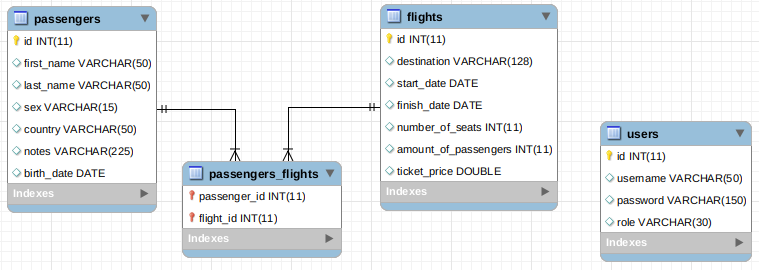
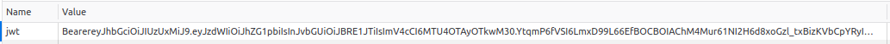

# Space Flights

https://myspacetrip.herokuapp.com/login

## Description

The application has been created to manage space travel. There is two entity: FLight and Passenger.
Entities are linked each other with many to many relation.

### Database architecture:

### Security:

Application demands user authentication. After successful authentication, the application generates the JSON web token for authorization every request using the SHA-256 Secure Hash Algorithm.

The user password is encrypted using the BCryptPasswordEncoder.

### Application has several functionalities:
* create new fligth
* create new passenger
* update flight or passenger
* assign passenger to flight or flight to passenger
* delete flight from passenger account
* delete passenger from specific flight
* display list of flights or passengers
* searching for flight

### Applied technologies:
#### Backend:
* Java
* Spring boot
* MySQL
* Hibernate
* Maven

#### Frontend:
* React.js 
* CSS 
* Bootstrap

### To do:
* add searching method for passenger
* add spring security integration with react
* add client panel for flight reservation
